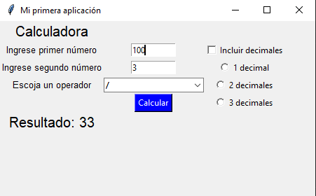
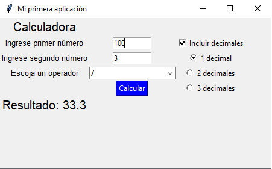
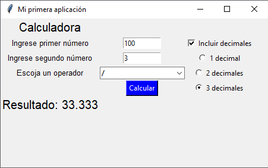
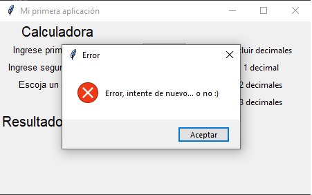

# Calculadora
Grupo #12
Integrantes
1. Juan Camilo Olya Arango

Widgets Adicionales:

1. RadioButton: Para seleccionar la cantidad de decimales que serán impresas
2. MessageBox: En caso de que se ingresen valores nulos u operaciones imposibles como división entre 0
3. CheckButton: para seleccionar si se desean o no obtener decimales

Imágenes:

